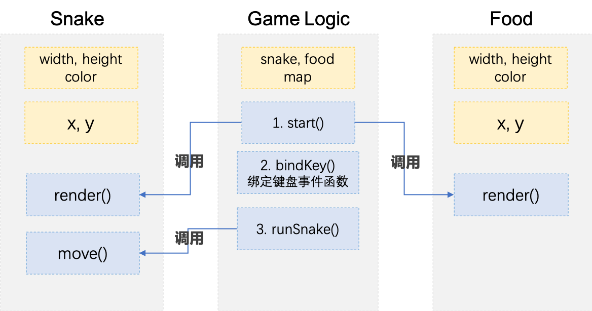
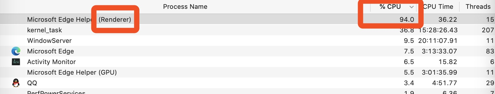

### 一、说明

本项目使用 ES5 写了贪吃蛇核心逻辑，练习 JS OOP 理念。

### 二、如何使用
- 点击预览链接，进入网页即开始游戏
- 使用键盘方向键控制蛇移动
- 胜利条件：无
- 结束条件：控制蛇碰到画布边缘

### 三、实现过程
#### 1. 分析
- 游戏核心逻辑
	1. 开局生成蛇和食物，食物位置随机；
	2. 蛇自动向右移动，用键盘方向键可控制蛇移动方向；
	3. 蛇遇到画布边缘，游戏结束；
	4. 蛇遇到食物，食物消失，蛇身体变长一节，随机位置生成食物。

- 实现上述逻辑，在 JS 中要规划哪些对象

	从零到屏幕上出现运动的蛇和食物，至少经过两个阶段：
	1. 在 JS 程序中选用某种数据结构存放蛇和食物的**数据**;
	2. 抽取对象中的数据，通过 DOM 接口添加到 HTML 文档树，渲染到屏幕上。

	我们选择 JS 中的对象结构，对象是一系列属性的集合，其属性可以是任何类型的值，包括函数。所以用对象的属性来存放游戏过程中的数据，由对象的方法来动态地改变这些数据。

	贪吃蛇游戏需要规划三个对象：
	1. 食物对象，包含这些属性和方法：
		{
			大小 - 属性，
			位置 - 属性，
			随机位置渲染-方法，
			能被移除-内部函数
		}
	2. 蛇对象，包含这些属性和方法:
		{
			大小 - 属性，
			位置 - 属性，
			渲染 - 方法，
			能被移除 - 内部函数，
			移动 - 方法
		}
	3. 游戏对象，包含这些属性和方法：
		{
			食物 - 属性，
			蛇 - 属性，
			画布 - 属性，
			开始游戏 - 方法，
			键盘绑定 - 内部函数，
			通过蛇的位置判断游戏是否结束 - 内部函数，
		}


#### 2. 设计

上述对象都用构造函数来写，使用的使用的时候 `new` 出相应的对象，获取属性和方法。为了便于管理，上述对象都放到独立文件中，成为模块。

这些模块大致关系如下：


#### 3. 实现
具体实现过程略，总的思路是先实现静态效果，再一步步添加动画。如先实现一条静止的蛇，再实现自动移动（setInterval(fn,150)），再实现接收键盘响应。


### 四、过程中的发现

实现过程中遇到出现一些新发现和错误，有些查阅后解决，有些还没弄明白，这里做记录供以后回顾：

1. 用 JS 设置节点的 `style` 属性时，宽、高无法正常显示到页面上。(注，问题已解决，等号右边少了冒号，Sublime Text 编辑器提示我的)
结果舍弃了用 JS 直接设定`style` 的做法，改为用 `setAttribute` 添加已有的 css class

```javascript
var map = document.getElementById('map'); 

var div = document.createElement('div'); 
map.appendChild(div);

div.style.width = 20px; // 写的过程中发现了问题，少了冒号，等式右边应该是‘20px’
div.style.height = 20px; 

```

2. 引发了一次浏览器当机
```javascript
for (var i = 0, len = arr.length; i < len; i++) {
	if (i = 0) {
		// dosomething
	}
}
```
蛇其实由一个个 `div` 构成，每个 `div` 代表蛇的一节身体，这些 `div` 在 JS 中的数据表达是一个数据中的对象，因此在渲染的时候要遍历这个数据，取出其中每个对象，为它设置 `style` 属性，插入到文档树中。

因为蛇头（数组中的第一个元素）和蛇身的样式不同，上述代码的目的是想在 `for` 循环遍历第一个元素时，为它设定特别的样式，从第二个元素开始，应用相同的样式。

结果如下图：


浏览器估计一直在遍历的第一次中没出来。

3. 相同目录的文件在 CSS 和 JS 文件中引用的路径不同

src
  ——css
  	——style.css
  ——JS
  	——snake.js
  ——images
  	——head.png

引用 images 文件夹中的 `head.png`
在 CSS 中：
```css
.snake {
	background-image: url("../images/head.png");
}
```

在 JS 中：
```javascript
var div = document.createElement('div'); // 创建div，为它添加style.backgroundImage

div.style.backgroundImage = 'url("images/head.png")'

```

JS 中不用添加返回上级目录 ‘../’

4. ES5 中，避免命名空间冲突的做法是，把每个 JS 文件中的函数用 `IIFE` 表达式包裹，把其中需要被其他 JS 文件调用的添加到 window 全局对象上。

5. 代码在本地写好后，部署到远程服务器，需要进行多文件的合并以及代码压缩的工作，这两个在本项目没做。

### 五、参考
本项目的来源、实现过程均参考课程 2018 传智播客Web前端培训《JavaScript 进阶》课程的贪吃蛇项目。

### 六、更新日期
2020-04-20 写反思，项目阶段性完结，学习新东西后回头重构
2020-04-19 动手实现
2020-04-18 观看教程视频


